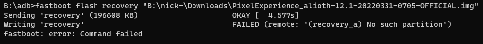

# 🔓 Разблокировка загрузчика

Для того, чтобы начать модифицировать ПО, нужно разблокировать загрузчик. Если на других устройствах всё делается за один присест и одной командой в терминале, то с Xiaomi ситуация куда интереснее. Для начала вам нужно создать Mi аккаунт и войти в него с телефона. Без этого никуда. Далее:

1. Зайдите в настройки
2. Перейдите в раздел "О телефоне"
3. Нажмите около 10-ти раз на строку "Версия MIUI (для POCO)", пока не появится уведомление внизу: "Вы стали разработчиком!"
4. Выйдите из раздела "О телефоне"
5. Перейдите в раздел Расширенные настройки -> Для разработчиков
6. Перейдите в раздел "Статус Mi Unlock"
7. Соглашайтесь с передачей нужных данных.
8. **Теперь важно!** Используйте мобильный интернет и свяжите Mi аккаунт с вашим устройством.

<figure><figcaption><p>Вот так должно это выглядеть, но на английском языке.</p></figcaption></figure>


Выберите операционную систему, с которой вы хотите разблокировать загрузчик.




Теперь нужно скачать программу Mi Unlock ([Яндекс.Диск](https://disk.yandex.ru/d/zLJ7\_Oa0vUT84Q), [с сервера cum-zone](https://static.cum-zone.ru/files/mi\_unlock/unlock.zip)).

При запуске программы не соглашайтесь на обновление. Согласитесь с условием соглашения и войдите в Mi аккаунт. После успешной авторизации сделайте следующее:

1. Выключите телефон
2. Зажмите кнопку включения и кнопку громкости вниз
3. Как только телефон включится в режиме Fastboot (на экране появится соответствующая надпись), подключите телефон к компьютеру.
4. Нажмите на заветную кнопку Unlock.
5. Согласитесь с тем, что все данные будут стёрты после процедуры разблокировки.
6. Согласитесь с тем, что ваше устройство станет более уязвимым.

Начнётся процесс разблокировки. И тут происходит ошибка, телефон перезагружается в систему без форматирования, а вам сообщают радостную новость: попробуйте через 168 часов!

<figure><figcaption><p>Та самая ошибка.</p></figcaption></figure>

Мы проделали все эти действия, чтобы запустить таймер, по истечению которого нужно будет подключить телефон снова и разблокировать загрузчик. Никто не знает, как работает этот таймер. Кому-то дают 168 часов (неделя), кому-то 360 часов (15 дней). Это чистое казино.

По истечению таймера повторите действия с разблокировкой и вы получите на руках разблокированное устройство.

<figure><figcaption><p>Итог, который все так ждали!</p></figcaption></figure>




Гайд находится в бета-тестировании. Проверено на Liunx Mint.


Для данной ОС воспользуемся утилитой XiaoMiTool V2 от francescotescari.

1. Откройте терминал
2.  Установите нужные пакеты командой:

    ```
    sudo apt-get install default-jdk openjfx nano git fastboot adb
    ```
3.  Склонируйте репозиторий командой

    ```
    git clone https://github.com/francescotescari/XiaoMiToolV2.git && cd XiaoMiToolV2
    ```
4.  Переключитесь на ветку linux командой

    ```
    git checkout linux && git branch
    ```

Теперь нужно изменить пару файлов:

1.  Введите команду

    ```
    nano src/main/java/com/xiaomitool/v2/gui/controller/LoginController.java
    ```
2. Перейдите на 39 строку: Зажмите одновременно "Ctrl + Shift + \_", введите номер строки.
3. Удалите эту строку с помощью "Ctrl + K"
4.  Вставьте строку

    ```
    private static final String LOGIN_URL = "https://account.xiaomi.com/pass/serviceLogin?sid=unlockApi&json=false&passive=true&hidden=false&_snsDefault=facebook&checkSafePhone=true&_locale=" + Locale.getDefault().getLanguage().toLowerCase();
    ```
5. <mark style="color:red;">**Не забудьте про 4 пробела от начала строки!**</mark>
6. Сохраните файл с помощью "Ctrl + X" + "y" + "Enter"
7.  Введите

    ```
    nano build.gradle.kts
    ```
8. Перейдите на 35 строку: Зажмите одновременно "Ctrl + Shift + \_", введите номер строки.
9. Измените версию с 11.0.2 на 17.0.1
10. Сохраните файл с помощью "Ctrl + X" + "y" + "Enter"

Теперь соберем программу:

1. ```
   chmod +x gradlew
   ```
2. ```
   sudo bash gradlew build
   ```
3. ```
   sudo bash gradlew run
   ```

Подвердите дисклеймер, выберите нужный сервер, войдите в аккаунт xiaomi, подключите устройство, выберите "My device works normally. I want to mod it.", следуйте инструкциям на экране. После выберите: Lock, unlock bootloader -> Unlock bootloader. Выполните все действия на экране и вы получите разблокированный загрузчик.

Гайд сделан на основе гайда для Arch Linux от stason.s7 ([`Ссылка`](https://4pda.to/forum/index.php?showtopic=721838\&st=49580#entry111094022)).


