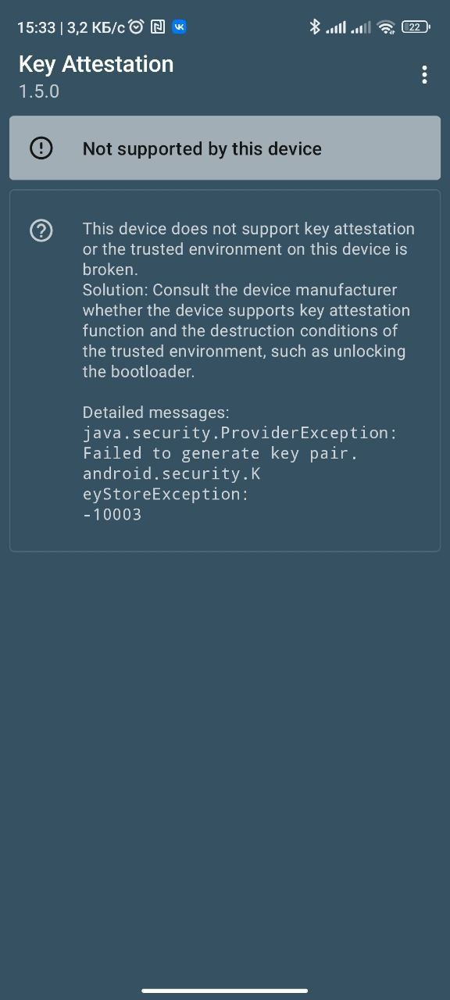

# 🔑 Восстановление TEE

Итак, вы либо послушали мою дурную голову пару лет назад или прошивка оказалась полной говной, но итог очевиден - после возвращения на сток вы в приложении Key Attestation Demo увидели следующую ошибку:

<figure><figcaption><p>Поздравляю, вы проебали ключи!</p></figcaption></figure>

Подпись под скриншотом всё правильно поясняет, вы потеряли ключи аттестации Widevine, FIDO, IFAA и Google. Если первые три не так уж и страшны, то Google'овские ключи - уже беда.

По сути, это может вам помешать адекватной работе банковских приложений. В реальных условиях, даже с потерянными ключами и заблокированным загрузчиком спокойно работали обновления системы через Google Play, T-Pay, Mir Pay, SberPay и вообще все банковские приложения, которые я когда-либо устанавливал. Всё-же я настоятельно советую восстановить ключи аттестации для восстановления работы TEE.

## Подготовка к восстановлению.

Для восстановления TEE вам нужно:

* Инженерное ПО - [скачать здесь](https://mifirm.net/downloadfile/100).
* keybox.xml файл, можно взять [отсюда](https://github.com/chiteroman/Reprogram-TEE-on-Qualcomm-devices/blob/main/keybox.xml).

## Восстановление TEE.

* Установите инженерное ПО на ваше устройство ([#s-pomoshyu-fastboot](../ROMs/universal-guide.md#s-pomoshyu-fastboot "mention"))
* Подключите телефон к компьютеру, откройте ADB, в папку с ADB положите keybox.xml
* Введите следующие команды:
* ```
  adb root
  ```
* ```
  adb remount
  ```
* ```
  adb reboot
  ```
* ```
  adb shell mkdir -p /data/nativetest64/qti_keymaster_tests/
  ```
* ```
  adb push keybox.xml /data/nativetest64/qti_keymaster_tests/
  ```
* ```
  adb shell LD_LIBRARY_PATH=/vendor/lib64/hw KmInstallKeybox /data/nativetest64/qti_keymaster_tests/keybox.xml 0 true
  ```

Если у вас другой keybox.xml, то используйте следующую команду:

adb shell LD\_LIBRARY\_PATH=/vendor/lib64/hw KmInstallKeybox /data/nativetest64/qti\_keymaster\_tests/{KEYBOX FILE} {DEVICE ID} {ATTEST PROPS?}

Где:

* {KEYBOX FILE}: Должен быть "keybox.xml".
* {KEYBOX DEVICE ID}: Откройте файл keybox и найдите "DeviceID".&#x20;
* {ATTEST PROPS?}: Должно быть true/false.

После возвращаете сток, и ключи восстановлены. Возможно, аттестация в Google Play не будет пройдена, но всё-же одной проблемой меньше.
